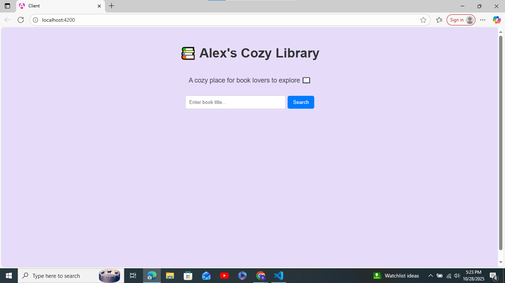
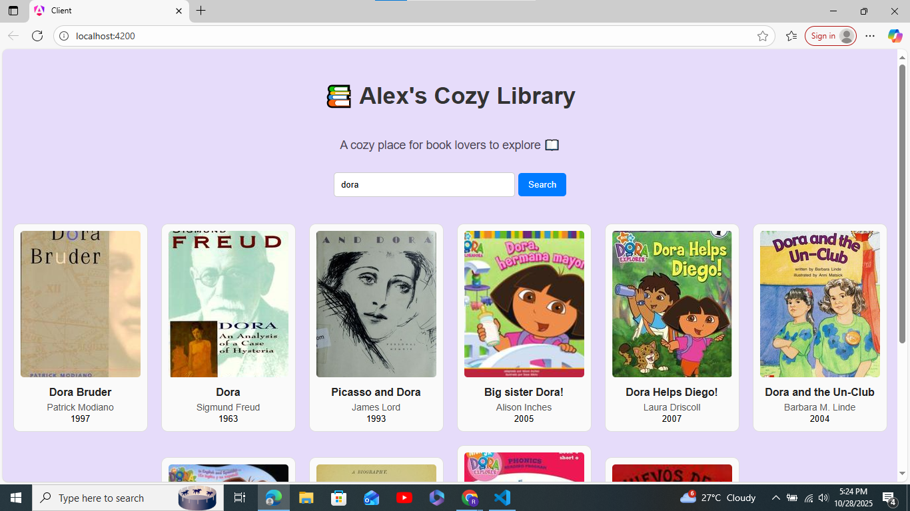

# 📚 Alex’s Cozy Library — Book Finder App

_A cozy place for book lovers to explore and discover new reads._

---

## 🌟 Overview

**Alex’s Cozy Library** is a web application built with the **MEAN stack (MongoDB, Express, Angular, Node.js)**.  
It allows users to **search for books by title** using the Open Library API and view key details such as:

- 📖 **Book title**
- ✍️ **Author name**
- 🗓️ **First publish year**
- 🖼️ **Book cover**

The app delivers a clean, cozy, and beginner-friendly UI designed for simple book discovery.

---

## 🎯 Features

✅ Search books instantly using the Open Library API  
✅ View book cover, title, author, and publication year  
✅ User-friendly lilac-themed design  
✅ Responsive layout (works on all screen sizes)  
✅ “No results” and “loading” states for better user experience  

---

## 🛠️ Tech Stack

| Layer | Technology | Purpose |
|-------|-------------|----------|
| **Frontend** | Angular 20 | UI and routing |
| **Backend** | Node.js + Express | API handling and server logic |
| **External API** | [Open Library API](https://openlibrary.org/developers/api) | Fetch book details |
| **Styling** | CSS3 / Angular styles | Lilac cozy theme |

---

## 🧩 Folder Structure

BookFinder/
│
├── MEAN-app/
│   │
│   ├── client/                      # 🌐 Angular Frontend
│   │   ├── src/
│   │   │   ├── app/
│   │   │   │   ├
│   │   │   │   │   
│   │   │   │   │
│   │   │   │   ├── components/
│   │   │   │   │   ├── book-search/ # 🔍 Search bar + results section
│   │   │   │   │   
│   │   │   │   │
│   │   │   │   ├── app.routes.ts    # 🚦 Routing setup for Angular
│   │   │   │   ├── main.ts          # 🧠 App entry point
│   │   │   │   └── styles.css       # 🎨 Global styling
│   │   │
│   │   └── angular.json, tsconfig.json, etc.
│   │
│   ├── server/                      # ⚙️ Node + Express Backend
│   │   ├── src/
│   │   │   ├── app.js               # 🚀 Main Express app file
│   │   │   ├── server.js            # 🧩 Server entry point
│   │   │   ├── routes/
│   │   │   │   └── bookRouter.js    # 🛣️ API routes for books
│   │   │   ├── controllers/
│   │   │   │   └── bookController.js# 🧠 API logic (fetches from Open Library)
│   │   │   
│   │   │
│   │   ├── package.json             # 📦 Backend dependencies
│   │   └── .env                     # 🔒 Environment variables
│   │
│   └── package.json                 # 📦 Root configuration
│
└── README.md  
                      
Install:
- [Node.js](https://nodejs.org/)
- [Angular CLI](https://angular.io/cli)
- [MongoDB](https://www.mongodb.com/) (optional)
1.Backend
cd server
npm install
npm start

2.Frontend
cd client
npm install
ng serve

Deployedment links:
Frontend:https://stackblitz.com/~/github.com/Rhiswana/MEAN-app
Backend: https://msktw3-8000.csb.app/api/books
🧑‍💻 Author

Rhiswana Begam

🌐 GitHub :https://github.com/Rhiswana/BookFinder

💼 LinkedIn :linkedin.com/in/rhiswana-begam-b-284544286

💬 “Creating cozy spaces for readers, one app at a time.”
